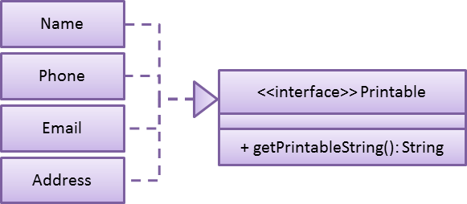
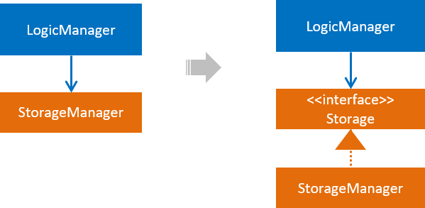
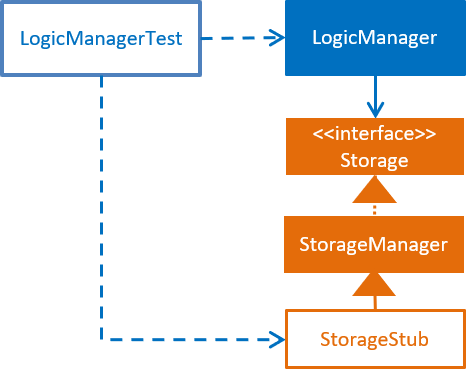

After studying this code and completing the corresponding exercises, you
should be able to,

## Utilize User Stories `[LO-UserStories]`

### References

  - [se-edu/se-book: Requirements: Specifying Requirements: User
    Stories](https://se-edu.github.io/se-book/specifyingRequirements/userStories/)

### Exercise: Add more user stories

  - Assume you are planing to expand the functionality of the
    AddressBook (but keep it as a CLI application). What other user
    stories do you think AddressBook should support? Add those user
    stories to the `DeveloperGuide.adoc`.

## Utilize use cases `[LO-UseCases]`

### References

  - [se-edu/se-book: Requirements: Specifying Requirements: Use
    Cases](https://se-edu.github.io/se-book/specifyingRequirements/useCases/)

### Exercise: Add a 'Rename tag' use case

  - Add a use case to the `DeveloperGuide.adoc` to cover the case of
    *renaming of an existing tag*. e.g. rename the tag `friends` to
    `buddies` (i.e. all persons who had the `friends` tag will now have
    a `buddies` tag instead) Assume that AddressBook confirms the change
    with the user before carrying out the operation.

## Use Non Functional Requirements `[LO-NFR]`

### References

  - [se-edu/se-book: Requirements: Non-Functional
    Requirements](https://se-edu.github.io/se-book/requirements/nonFunctionalRequirements/)

### Exercise: Add more NFRs

  - Add some more NFRs to the `DeveloperGuide.adoc`

## Use Polymorphism `[LO-Polymorphism]`

Note how the `Command::execute()` method shows polymorphic behavior.

### References

  - [se-edu/se-book: Paradigms: OOP:
    Polymorphism](https://se-edu.github.io/se-book/oop/polymorphism/)

  - [se-edu/se-book: C++ to Java: OOP:
    Polymorphism](https://se-edu.github.io/se-book/cppToJava/inheritance/polymorphism/)

### Exercise: Add a polymorphic `isMutating` method

  - Add a method `boolean isMutating()` to the `Command` class. This
    method will return `true` for command types that mutate the data.
    e.g. `AddCommand`

  - Currently, AddressBook data are saved to the file after every
    command. Take advantage of the the new method you added to limit
    file saving to only for command types that mutate data. i.e. `add`
    command should always save the data while `list` command should
    never save data to the file.



## Use abstract classes/methods `[LO-Abstract]`

### References

  - [se-edu/se-book: Paradigms: OOP: Abstract
    Classes](https://se-edu.github.io/se-book/oop/inheritance/abstractClasses/)

  - [se-edu/se-book: C++ to Java: OOP: Abstract
    Classes](https://se-edu.github.io/se-book/cppToJava/inheritance/abstractClassesAndMethods/)

### Exercise: Make `Command#execute()` method abstract

  - Make the `Command#execute()` method abstract (hint: refer to the
    comment given below the method)

## Use interfaces `[LO-Interfaces]`

Note how the `AddressBook` class implements the `ReadOnlyAddressBook`
interface so that clients who don’t need write access to the
`AddressBook` can access the `AddressBook` through the
`ReadOnlyAddressBook` interface instead.


### References

  - [se-edu/se-book: Paradigms: OOP: Abstract
    Interfaces](https://se-edu.github.io/se-book/oop/inheritance/interfaces/)

  - [se-edu/se-book: C++ to Java: OOP: Abstract
    Interfaces](https://se-edu.github.io/se-book/cppToJava/inheritance/interfaces/)

### Exercise: Add a `Printable` interface

  - Add a `Printable` interface as follows.

    

  - `Override` the `getPrintableString` in classes `Name`, `Phone`,
    `Email`, and `Address` so that each produces a printable string
    representation of the object. e.g. `Name: John Smith`,
    `Phone: 12349862`

  - Add the following method in a suitable place of some other class.
    Note how the method depends on the Interface.

    ``` java
    /**
     * Returns a concatenated version of the printable strings of each object.
     */
    String getPrintableString(Printable... printables) {
    ```

    The above method can be used to get a printable string representing
    a bunch of person details. For example, you should be able to call
    that method like this:

    ``` java
    // p is a Person object
    return getPrintableString(p.getPhone(), p.getEmail(), p.getAddress());
    ```

## Follow Liskov Substitution Principle `[LO-LSP]`

### References

  - [se-edu/se-book: Principles: Liskov Substitution
    Principle](https://se-edu.github.io/se-book/principles/liskovSubstitutionPrinciple/)

### Exercise: Add an exception to an overridden method

  - Add a `throws Exception` clause to the `AddCommand::execute` method.
    Notice how Java compiler will not allow it, unless you add the same
    `throws` clause to the parent class method. This is because if a
    child class throws an exception that is not specified by the
    Parent’s contract, the child class is no longer substitutable in
    place of the parent class.

  - Also note that while in the above example the compiler enforces LSP,
    there are other situations where it is up to the programmer to
    enforce it. For example, if the method in the parent class works for
    `null` input, the overridden method in the child class should not
    reject `null` inputs. This will not be enforced by the compiler.

## Use Java-FX for GUI programming `[LO-JavaFx]`

### References

  - [se-edu/se-book: Tools: Java: JavaFX:
    Basic](https://se-edu.github.io/se-book/javaTools/javaFXBasic/)

### Exercise: Enhance GUI

  - Do some enhancements to the AddressBook GUI. e.g. add an application
    icon, change font size/style

## Analyze Coupling and Cohesion of designs `[LO-CouplingCohesion]`

  - Notice how having a separate `ParserUtil` class to handle user input
    validation, space trimming etc. of model data (an application of the
    Single Responsibility Principle) improves the *cohesion* of the
    model component (since it does not need to be concerned with
    handling user input) as well as the `ParserUtil` class.

### References

  - [se-edu/se-book: Design: Design Principles:
    Coupling](https://se-edu.github.io/se-book/designFundamentals/coupling/)

  - [se-edu/se-book: Design: Design Principles:
    Cohesion](https://se-edu.github.io/se-book/designFundamentals/cohesion/)

### Exercise: Identify places to reduce coupling and increase cohesion

  - Where else in the design coupling can be reduced further, or
    cohesion can be increased further?

## Apply Dependency Inversion Principle `[LO-DIP]`

  - Note how the `LogicManager` class doesn’t depend on `StorageManager`
    directly, but rather the interface `Storage`. This is an application
    of the Dependency Inversion Principle.

    

  - Where else in the code do you notice the application of DIP?

### References

  - [se-edu/se-book: Principles: Dependency Inversion
    Principle](https://se-edu.github.io/se-book/principles/dependencyInversionPrinciple/)

## Use Dependency Injection `[LO-DI]`

Notice how the `LogicManager` class does not depend on the
`StorageManager` class, but depends on the `Storage` interface. This
allows us to use *Dependency Injection* to test the `LogicManager` class
without getting the `StorageManager` class involved.

### References

  - [se-edu/se-book: Quality Assurance: Testing: Dependency
    Injection](https://se-edu.github.io/se-book/testing/dependencyInjection/)

### Exercise: Facilitate injecting a StorageStub

  - Notice how `LogicManagerTest` tests `LogicManager` by constructing a
    `StorageManager` object.

  - Implement `StorageStub` such that calls to its `save*` methods do
    nothing (i.e. empty method body).

  - Update `LogicManagerTest` to work with the `StorageStub` instead of
    the actual `StorageManager` object. i.e. `LogicManagerTest` injects
    a `StorageStub` object when constructing a `LogicManager` before
    testing it.

    

  - The example above uses
    [DIP](#apply-dependency-inversion-principle-lo-dip) as a means to
    achieve DI. Note that there is another way to inject a `StorageStub`
    object, as shown below. In this case we do not apply the DIP but we
    still achieve DI.

    

## Apply Open-Closed Principle `[LO-OCP]`

### References

  - [se-edu/se-book: Principles: Open-Closed
    Principle](https://se-edu.github.io/se-book/principles/openClosedPrinciple/)

### Exercise: Analyze OCP-compliance of the `LogicManager` class

  - Consider adding a new command to the Address Book. e.g. an `edit`
    command. Notice how little you need to change in the `LogicManager`
    class to extend its behavior so that it can execute the new command.
    That is because `LogicManager` follows the OCP i.e. `LogicManager`
    is *open to be extended* with more commands but *closed for
    modifications*.

  - Is it possible to make the `AddressBookParser` class more
    OCP-compliant in terms of extending it to handle more command types?

  - In terms of how it saves data, is `LogicManager` more OCP-compliant
    due to the application of DIP as given in
    [`LO-DIP`](#apply-dependency-inversion-principle-lo-dip)? How can
    you improve `LogicManager`'s OCP-compliance further so that it can
    not only work with different types of storages, but different number
    of storages (e.g. save to both a text file and a database).

## Work in a 3KLoC code base `[LO-3KLoC]`

### Exercise: Enhance AddressBook

  - Enhance AddressBook in some way. e.g. add a new command
