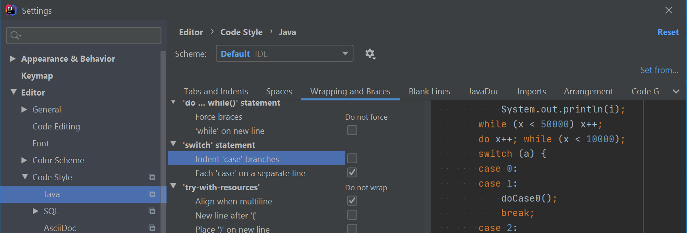

* Table of Contents
{:toc}

--------------------------------------------------------------------------------------------------------------------

## Setting up the project in your computer

1. Ensure you have the following prerequisites:
   * **JDK `11`** or above
   * **IntelliJ** IDE: IntelliJ by default has Gradle and JavaFx plugins installed.  Do not disable them. If you have disabled them, go to `File` \> `Settings` \> `Plugins` to re-enable them.
1. Fork this repo, and clone the fork to your computer.
1. Open IntelliJ (if you are not in the welcome screen, click `File` \> `Close Project` to close the existing project dialog first).
1. Set up the correct JDK version for Gradle.
    1. Click `Configure` \> `Project Defaults` \> `Project Structure`
    1. Click `New…​` and set it to the directory of the JDK.
1. Click `Import Project` (or `Open or Import` in newer version of Intellij).
1. Locate the `build.gradle` file and select it. Click `OK`.
1. Click `Open as Project`.
1. Click `OK` to accept the default settings.
1. To verify the setup,
   1. run the `seedu.address.Main` and try a few commands
   1. [run the tests](Testing.md) to ensure they all pass

:exclamation: <b>Caution: </b>

Before writing code, there are some configurations that you need to do. They are given in the section below.

--------------------------------------------------------------------------------------------------------------------

## Before writing code

### Configure the coding style

This project follows [oss-generic coding standards](https://oss-generic.github.io/process/docs/CodingStandards.html). IntelliJ’s default style is mostly compliant with ours but it uses a different import order from ours. To rectify,

1. Go to `File` \> `Settings…​` (Windows/Linux), or `IntelliJ IDEA` \> `Preferences…​` (macOS).
1. Select `Editor` \> `Code Style` \> `Java`.
1. Click on the `Imports` tab to set the import order.
   * For `Class count to use import with '*'` and `Names count to use static import with '*'`: Set to `999` to prevent IntelliJ from contracting the import statements.
    * For `Import Layout`: The order is: 
     `import static all other imports` 
     `<blank line>` 
     `import java.*` 
     `<blank line>` 
     `import javax.*` 
     `<blank line>` 
     `import org.*` 
     `<blank line>` 
     `import com.*` 
     `<blank line>` 
     `import all other imports` 
1. Click on the `Wrapping and Braces` tab and un-tick the `Indent 'case' branches` option. 
   

:bulb: **Tip:** 

Optionally, you can follow the [_Checkstyle Tutorial_ at se-edu/guides](https://se-education.org/guides/checkstyleTutorial.html) to find how to use the CheckStyle within IDEA e.g., to report problems _as_ you write code.

### Set up CI

This project comes with a GitHub Actions config files (in `.github/workflows` folder). When GitHub detects those files, it will run the CI for your project automatically at each push to the `master` branch or to any PR. No set up required.

### Learn the design

When you are ready to start coding, we recommend that you get some sense of the overall design by reading about [AddressBook’s architecture](DeveloperGuide.md).

### Do the tutorials

These tutorials will help you get acquainted with the codebase.

* [Tracing Code](tutorials/TracingCode.md)
* [Removing Fields](tutorials/RemovingFields.md)