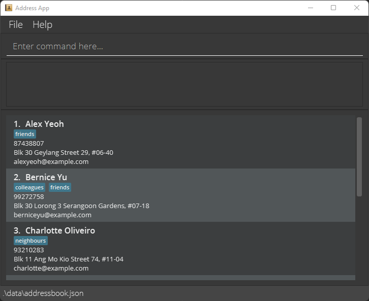

* Table of Contents
{:toc}

--------------------------------------------------------------------------------------------------------------------

## Quick start

1. Ensure you have Java `11` or above installed in your Computer.

1. Download the latest `addressbook.jar` from [here](https://github.com/se-edu/addressbook-level3/releases).

1. Copy the file to the folder you want to use as the _home folder_ for your AddressBook.

1. Open a command terminal, `cd` into the folder you put the jar file in, and use the `java -jar addressbook.jar` command to run the application.<br>
   A GUI similar to the below should appear in a few seconds. Note how the app contains some sample data.<br>
   

1. Type the command in the command box and press Enter to execute it. e.g. typing **`help`** and pressing Enter will open the help window.<br>
   Some example commands you can try:

   * `list` : Lists all contacts.

   * `add n/John Doe p/98765432 e/johnd@example.com a/John street, block 123, #01-01` : Adds a contact named `John Doe` to the Address Book.

   * `delete 3` : Deletes the 3rd contact shown in the current list.

   * `clear` : Deletes all contacts.

   * `exit` : Exits the app.

1. Refer to the [Features](#features) below for details of each command.

--------------------------------------------------------------------------------------------------------------------

User Guide

TrAcker is a **desktop app for CS2040 Teaching Assistants to centralise the CS2040 tasks involving them. It is optimised for use via a Command Line Interface (CLI)** while still having benefits of a Graphical User Interface (GUI). If you can type fast, TrAcker will display all the tutorials, labs and consultations in a specific time frame. You will also be able to visualise your schedule in a calendar format. Students involved in an event will be displayed based on preference.

**Features **

### Adding a recurring event: `add recur`

Adds a recurring task to the TA’s schedule. Recurring task defaults to once a week, but can be specified as a period if needs to be changed (Period = 2 means twice a week). Duration is in hours.

**Name must be unique. There cannot be clashes in the time as well. If there is, then show a confirmation message to overwrite an old recurring task with the same name or same time.**

Format: `touch recur [name] [type] [day] [time] [duration] [period]`

Examples:


* `touch recur fornightLabs Labs Friday 10:00 2 0.5`
* `touch recur biWeeklyConsults Consultations Thursday 16:00 1 2`
* `touch recur weeklyTutorials Tutorials Wednesday 14:00 1 1`


### List all recurring event: `list recur`

Lists all recurring tasks in the TA’s schedule. Can be filtered to have particular recurring events only.

Format: `ls recur [task]`

Examples:


* `ls recur`
* `ls recur labs`
* `ls recur consultations`
* `ls recur tutorials`

Find specific recurring event: `find recur`

Find a specific recurring task during a timeframe

Format: `/ recur [timeframe] [startTime] [endTime]`

Examples:


* `/ recur Wednesday`
* `/ recur Wednesday 8:00 10:00`

Deleting recurring event: `delete recur`

Delete recurring tasks based on index from list of **all **recurring tasks

Format: `:[start],[end]d`

Examples:


* `:5d`
* `:5,10d`
* `:%d`
* `:.,10d`
* `:1d,$`

Edit recurring event: `edit recur`

Edit recurring tasks based on index from list of **all **recurring tasks or unique name

Format:


* `:/%s/[name] or [index]/[new recurring task details]/g`
* `:/%s/[name] or [index]/[new recurring task details]/gc`

Examples:


* `:/%s/weeklyTutorials/weeklyTutorials Tutorials Wednesday 18:00 1 1/g`
* `:/%s/1/weeklyTutorials Tutorials Wednesday 18:00 1 1/g`

Show recurring event in calendar: `show recur calendar`

Show specific recurring task based on index from list of **all **recurring tasks or based on name

Format:


* `cd [name] or [index] calendar`

Examples:


* `:cd 1`
* `:cd weeklyTutorials`

Navigate to students in recurring event: `show recur students`

Show specific recurring task students based on index from list of **all **recurring tasks or based on name.

Once entered, use the students command features to add, delete, edit students.

Format:


* `:cd [name] or [index] students`

Examples:


* `:cd 1 students`
* `:cd weeklyTutorials students`

Move recurring event to normal event: `mv recur`

Move specific recurring tasks based on index from list of **all **recurring tasks or based on name to a normal event.

Only applicable for the next immediate recurring task

Format:


* `:mv [name] or [index]`

Examples:


* `:mv 1`
* `:mv weeklyTutorials`

Stop recurring event to normal event: `stop recur`

Removing a recurring task will remove all data related to it. If the user wants to visually see the past recurring task but wants to stop the recurring task in the future, the user should use this.

This has the same functionality as move, but it just does not move the next immediate recurring task to a normal task.

Format:


* `stop [name] or [index]  `

Examples:


* `:stop 1`
* `:stop weeklyTutorials`


### Sort recurring events: `sort recur`

Sorts the recurring events available in the order specified by the TA. The sorting method can either be alphabetical, date or duration. With each sorting method, the TA can also choose top down or bottom up order as well.

The sorted list should be a secondary list and does not replace the existing, non-sorted one. Additional features to replace the existing one may be added in the future if deemed useful.

Format: `sort [type] [sorting method] [sorting order]`

Examples:


* `sort lab alphabetical reverse`
* `sort tutorial duration nonreverse`
* `sort consultation date nonreverse`


### Help tutorial for recurring events: `help recur`

Returns a list of instructions on what the event encompasses and also what parameters and input format is required to successfully create said event.

This should help new TAs understand the syntax better and also reduces the need to memorise the syntax or refer to any external documentations.

Format: `help [type]`

Examples:


* `help lab`
* `help tutorial`
* `help consultation`


### Sort students in recurring events: `sort student`

Sorts the students in recurring events available in the order specified by the TA. The sorting method can either be alphabetical, participation level or urgency level. With each sorting method, the TA can also choose top down or bottom up order as well. If the TA wishes to sort all students under his supervision (regardless of type), he can specify type to be “all”.

The sorted list should be a secondary list and does not replace the existing, non-sorted one. Additional features to replace the existing one may be added in the future if deemed useful.

Format: `sort student [type] [sorting method] [sorting order]`

Examples:


* `sort student lab alphabetical reverse`
* `sort student tutorial participation nonreverse`
* `sort student consultation urgency nonreverse`
* `sort student all urgency nonreverse`


### Filter students in recurring events: `filter student`

Filters the students in recurring events depending on the metric specified by the TA. The metric can either be by a cut-off participation level (out of 100%) or minimum urgency level (out of 100). If the TA wishes to filter all students under his supervision (regardless of type), he can specify type to be “all”.

The filtered list should be a secondary list and does not replace the existing, non-sorted one. Additional features to replace the existing one may be added in the future if deemed useful.

Format: `filter student [type] [metric] [threshold]`

Examples:


* `filter student lab urgency 60 `
* `filter student tutorial participation 50`
* `filter student consultation urgency 20`
* `filter student all participation 90`


### Filter students in recurring events: `alert student`

Provides a list of students who are suddenly performing poorly based on a certain metric, such as a sudden drop in participation level or a sudden increase in urgency level.

The filtered list should be a secondary list and does not replace the existing, non-sorted one. As of now, this can be subjective and we will increase ways to customise this so that the TA can specify what he defines as a “sudden change”.

Format: `alert student [type] [metric] `

Examples:


* `alert student lab urgency `
* `alert student tutorial participation`
* `alert student consultation urgency`
* `alert student all participation`


### Adding a normal (non-recurring) event: `add recur`

Adds an event to the TA’s schedule. Duration is in hours.

**Name must be unique. There cannot be clashes in the time as well. If there is, then show a confirmation message to overwrite an old recurring task with the same name or same time.**

Format: `touch event [name] [type] [date] [time] [duration]`


```
date format: YYYY-MM-DD
```


Examples:


* `touch event Make-up-Lab Labs 2023-01-14 10:00 2`
* `touch event Consultation Consultations 2023-04-14 16:00 1`
* `touch event Extra-tutorial Tutorials 2023-04-14 14:00 1`


### List all non-recurring events: `list event`

Lists all non-recurring tasks in the TA’s schedule. Can be filtered to have particular events only.

Format: `ls event [task]`

Examples:


* `ls event`
* `ls event labs`
* `ls event consultations`
* `ls event tutorials`

Find specific non-recurring event: `find event`

Find a specific task on a particular date and (optional) time

Format: `/ event [date] [startTime] [endTime]`

Examples:


* `/ event 2023-04-01`
* `/ event 2023-03-12 8:00 10:00`

Deleting non-recurring event: `delete event`

Delete tasks based on index from list of **all **non-recurring tasks

Format: `:delete event [start],[end]d`

Examples:


* `:delete event 5d`
* `:delete event 5,10d`
* `:delete event %d`
* `:delete event .,10d`
* `:delete event 1d,$`

Edit non-recurring event: `edit event`

Edit tasks based on index from list of **all **non-recurring tasks or unique name

Format:


* `:/%s/nr/[name] or [index]/[new task details]/g`
* `:/%s/nr/[name] or [index]/[new task details]/gc`


```
nr stands for non-recurring
```


Examples:


* `:/%s/nr/make-up-Tutorial/Extra-tutorial Tutorials 2023-04-14 14:00 1/g`
* `:/%s/nr/1/Consultation Consultations 2023-04-14 16:00 1/g`

Show non-recurring event in calendar: `show event calendar`

Show specific task based on index from list of **all **non-recurring tasks or based on name

Format:


* `cd nr [name] or [index] calendar`

Examples:


* `:cd nr 1`
* `:cd nr Make-up-Tutorial`


```
nr stands for non-recurring
```


Navigate to students in recurring event: `show event students`

Show specific task’s students based on index from list of **all **non-recurring tasks or based on name.

Once entered, use the students command features to add, delete, edit students.

Format:


* `:cd nr [name] or [index] students`

Examples:


* `:cd nr 1 students`
* `:cd nr consultation students`


### Adding a student: `add student`

Adds a student to the student list.

Format: `add student n/NAME [p/PHONE_NUMBER] [e/EMAIL] [t/TUTORIAL_GROUP] [l/LAB_GROUP]`


```
Fields with brackets [] are optional. If they are empty, corresponding fields in the student's records will also be empty
```


Examples:


* `add student n/Dijkstra`
* `add student n/Tony Hoare p/97482842 t/T03 l/B09`


### List all students: `list student`

Lists all students of the TA user. Can be filtered according to events.

Format: `ls student [task]`

Examples:


* `ls student`
* `ls student Tutorials`
* `ls student Labs`

Deleting student: `delete student`

Delete students based on index from list of students corresponding to an event

Format:


1. `:cd EVENT students`
2. `:delete student INDEX`

Examples:


* `example 1`
    * `:cd weeklyTutorials students`
    * `:delete student 5`
* `example 2`
    * `:cd weeklyLabs students`
    * `:delete student 1`

Edit student: `edit student`

Edit student details from list of all students

Format: `edit INDEX n/NAME [p/PHONE_NUMBER] [e/EMAIL] [t/TUTORIAL_GROUP] [l/LAB_GROUP]`

Edits the student at the specified INDEX within the student list.

Existing values will be updated to the input values.

Examples:


* `edit 1 n/Dijkstra`
* `edit 2 n/Tony Hoare p/97482842 t/T03 l/B09`


### Add note for event: `touch note`

Add notes for events that are both normal and recurring, or for students in the classes this TA is in charge of. Mainly serves to help TAs take down notes and todos from meeting and student queries from classes.

Note that there can be an unlimited amount of notes to be created for each event or student.

Each addition increases node index by one.

Format: `touch note [type] [name or index] [content]`

Examples:


* `touch note recur weeklyTutorials "rmb to bring along apple pencil\n"`
* `touch note recur 2 "grade student labs timely\n"`
* `touch note student Eldon "solve this student's query via email\n"`


### Delete note for event: `delete note`

Delete notes for events that are both normal and recurring, or for students in the classes this TA is in charge of.

Format: `delete note [type] [name or index] [note-index]`

Examples:


* `delete note recur weeklyTutorials 3`
* `delete note recur 2 0`
* `delete note student Eldon 0`


### Edit note for event: `edit note`

Update notes with the new note for events that are both normal and recurring, or for students in the classes this TA is in charge of.

Note that when a particular note index does not exist, it does nothing.

Format:


* `edit note [type] [name or index] [note-index] [newcontent]`

Examples:


* `edit note recur weeklyTutorials 0 "no new tasks lol\n"`
* `edit note recur 2 0 "bring my lab cheat-sheet\n"`
* `edit note student Eldon 1 ""`


### List all notes: `ls note`

List all notes for events that are both normal and recurring, or for students in the classes this TA is in charge of.

Format: `ls note [type] [name or index]`

Examples:


* `ls note recur weeklyTutorials`

Sort student: `sort student`

Sort students by attributes such as their attendance rate for labs or tutorials (later by their exam grades)

Format: `sort student [type] [sorting order]`

This method is designed for ease of grading students based on their attendance to tutorials and labs.

Examples:


* `sort students labs reverse`
* `sort students tutorials nonreverse`


--------------------------------------------------------------------------------------------------------------------

## Command summary

<table>
  <tr>
   <td>Action
   </td>
   <td>Format
   </td>
   <td>Examples
   </td>
  </tr>
  <tr>
   <td><strong>Add recur</strong>
   </td>
   <td><code>touch recur [name] [type] [day] [time] [duration] [period]</code>
   </td>
   <td>
<ul>

<li><code>touch recur fornightLabs Labs Friday 10:00 2 0.5</code> 

<li><code>touch recur biWeeklyConsults Consultations Thursday 16:00 1 2</code>

<li><code>touch recur weeklyTutorials Tutorials Wednesday 14:00 1 1</code>
</li>
</ul>
   </td>
  </tr>
  <tr>
   <td><strong>Add student</strong>
   </td>
   <td><code>add student n/NAME [p/PHONE_NUMBER] [e/EMAIL] [t/TUTORIAL_GROUP] [l/LAB_GROUP]</code>
   </td>
   <td>
<ul>

<li><code>add student n/Dijkstra</code>

<li><code>add student n/Tony Hoare p/97482842 e/e0271183@u.nus.edu t/T03 l/B09</code>
</li>
</ul>
   </td>
  </tr>
  <tr>
   <td><strong>Add normal event</strong>
   </td>
   <td><code>touch event [name] [type] [date] [time] [duration]</code>
   </td>
   <td>
<ul>

<li><code>touch event Make-up-Lab Labs 2023-01-14 10:00 2</code>

<li><code>touch event Consultation Consultations 2023-04-14 16:00 1</code>

<li><code>touch event Extra-tutorial Tutorials 2023-04-14 14:00 1</code>
</li>
</ul>
   </td>
  </tr>
  <tr>
   <td><strong>List recur</strong>
   </td>
   <td><code>ls recur [task]</code>
   </td>
   <td>
<ul>

<li><code>ls recur</code>

<li><code>ls recur labs</code>

<li><code>ls recur consultations</code>

<li><code>ls recur tutorials</code>
</li>
</ul>
   </td>
  </tr>
  <tr>
   <td><strong>List non-recurring event</strong>
   </td>
   <td><code>ls event [task]</code> 
   </td>
   <td>
<ul>

<li><code>ls event</code>

<li><code>ls event labs</code>

<li><code>ls event consultations</code>

<li><code>ls event tutorials</code>
</li>
</ul>
   </td>
  </tr>
  <tr>
   <td><strong>List students</strong>
   </td>
   <td><code>ls student [task] </code>
   </td>
   <td>
<ul>

<li><code>ls student</code>

<li><code>ls student Tutorials</code>

<li><code>ls student Labs</code>
</li>
</ul>
   </td>
  </tr>
  <tr>
   <td><strong>Delete recur</strong>
   </td>
   <td><code>:[start],[end]d</code>
   </td>
   <td>
<ul>

<li><code>:5d</code>

<li><code>:5,10d</code>

<li><code>:%d</code> 

<li><code>:.,10d</code>

<li><code>:1d,$</code>
</li>
</ul>
   </td>
  </tr>
  <tr>
   <td><strong>Delete non-recurring event</strong>
   </td>
   <td><code>:delete event [start],[end]d</code>
   </td>
   <td>
<ul>

<li><code>:delete event 5d</code>

<li><code>:delete event 5,10d</code>

<li><code>:delete event %d</code> 

<li><code>:delete event .,10d</code>

<li><code>:delete event 1d,$</code>
</li>
</ul>
   </td>
  </tr>
  <tr>
   <td><strong>Delete student</strong>
   </td>
   <td>
<ol>

<li><code>:cd EVENT students</code>

<li><code>:delete student INDEX</code>
</li>
</ol>
   </td>
   <td>
<ul>

<li><code>example 1</code> 
<ul>

<li><code>:cd weeklyTutorials students</code>

<li><code>:delete student 5</code>
</li> 
</ul>

<li><code>example 2</code> 
<ul>

<li><code>:cd weeklyLabs students</code>

<li><code>:delete student 1</code>
</li> 
</ul>
</li> 
</ul>
   </td>
  </tr>
  <tr>
   <td><strong>Edit recur</strong>
   </td>
   <td>
<ul>

<li><code>:/%s/[name] or [index]/[new recurring task details]/g</code>

<li><code>:/%s/[name] or [index]/[new recurring task details]/gc</code>
</li>
</ul>
   </td>
   <td>
<ul>

<li><code>:/%s/weeklyTutorials/weeklyTutorials Tutorials Wednesday 18:00 1 1/g</code>

<li><code>:/%s/1/weeklyTutorials Tutorials Wednesday 18:00 1 1/g</code>
</li>
</ul>
   </td>
  </tr>
  <tr>
   <td><strong>Edit non-recurring event</strong>
   </td>
   <td>
<ul>

<li><code>:/%s/nr/[name] or [index]/[new task details]/g</code>

<li><code>:/%s/nr/[name] or [index]/[new task details]/gc</code>
</li>
</ul>
   </td>
   <td>
<ul>

<li><code>:/%s/nr/make-up-Tutorial/Extra-tutorial Tutorials 2023-04-14 14:00 1/g</code>

<li><code>:/%s/nr/1/Consultation Consultations 2023-04-14 16:00 1/g</code>
</li>
</ul>
   </td>
  </tr>
  <tr>
   <td><strong>Edit student</strong>
   </td>
   <td><code>edit INDEX n/NAME [p/PHONE_NUMBER] [e/EMAIL] [t/TUTORIAL_GROUP] [l/LAB_GROUP]</code>
   </td>
   <td>
<ul>

<li><code>edit 1 n/Dijkstra</code>

<li><code>edit 2 n/Tony Hoare p/97482842 t/T03 l/B09</code>
</li>
</ul>
   </td>
  </tr>
  <tr>
   <td><strong>Find recur</strong>
   </td>
   <td><code>/ recur [timeframe] [startTime] [endTime]</code>
   </td>
   <td>
<ul>

<li><code>/ recur Wednesday</code>

<li><code>/ recur Wednesday 8:00 10:00</code>
</li>
</ul>
   </td>
  </tr>
  <tr>
   <td><strong>Find non-recurring event</strong>
   </td>
   <td><code>/ event [date] [startTime] [endTime]</code>
   </td>
   <td>
<ul>

<li><code>/ event 2023-04-01</code>

<li><code>/ event 2023-03-12 8:00 10:00</code>
</li>
</ul>
   </td>
  </tr>
  <tr>
   <td><strong>Show recur</strong>
   </td>
   <td>
<ul>

<li><code>:cd [name] or [index] calendar</code>

<li><code>:cd [name] or [index] students</code>
</li>
</ul>
   </td>
   <td>
<ul>

<li><code>:cd 1</code>

<li><code>:cd weeklyTutorials</code>
</li>
</ul>
   </td>
  </tr>
  <tr>
   <td><strong>Show non-recurring event</strong>
   </td>
   <td>
<ul>

<li><code>cd nr [name] or [index] calendar</code>
</li>
</ul>
   </td>
   <td>
<ul>

<li><code>:cd nr 1</code>

<li><code>:cd nr Make-up-Tutorial</code>
</li>
</ul>
   </td>
  </tr>
  <tr>
   <td><strong>Sort student </strong>
   </td>
   <td><code>sort student [type] [sorting order]</code>
   </td>
   <td>
<ul>

<li><code>sort students labs reverse</code>

<li><code>sort students tutorials nonreverse</code>
</li>
</ul>
   </td>
  </tr>
  <tr>
   <td><strong>Move recur</strong>
   </td>
   <td><code>:mv [name] or [index]</code>
   </td>
   <td>
<ul>

<li><code>:mv 1</code>

<li><code>:mv weeklyTutorials</code>
</li>
</ul>
   </td>
  </tr>
  <tr>
   <td><strong>Stop recur</strong>
   </td>
   <td><code>stop [name] or [index]  </code>
   </td>
   <td>
<ul>

<li><code>:stop 1</code>

<li><code>:stop weeklyTutorials</code>
</li>
</ul>
   </td>
  </tr>
  <tr>
   <td><strong>Sort recur</strong>
   </td>
   <td><code>sort [type] [sorting method]</code>
   </td>
   <td>
<ul>

<li><code>sort labs alphabetical</code>

<li><code>sort consultation date</code>

<li><code>sort tutorial duration</code>
</li>
</ul>
   </td>
  </tr>
  <tr>
   <td><strong>Help recur</strong>
   </td>
   <td><code>help [type]</code>
   </td>
   <td>
<ul>

<li><code>help labs</code>

<li><code>help tutorial</code>

<li><code>help consultation</code>
</li>
</ul>
   </td>
  </tr>
  <tr>
   <td><strong>Sort student</strong>
   </td>
   <td><code>sort student [type] [sorting method] [sorting order]</code>
   </td>
   <td>
<ul>

<li><code>sort student lab alphabetical reverse</code> 

<li><code>sort student tutorial participation nonreverse</code>

<li><code>sort student consultation urgency nonreverse</code>

<li><code>sort student all urgency nonreverse</code>
</li>
</ul>
   </td>
  </tr>
  <tr>
   <td><strong>Filter student</strong>
   </td>
   <td><code>filter student [type] [metric] [threshold]</code>
   </td>
   <td>
<ul>

<li><code>filter student lab urgency 60 </code>

<li><code>filter student tutorial participation 50</code>

<li><code>filter student consultation urgency 20</code>

<li><code>filter student all participation 90</code>
</li>
</ul>
   </td>
  </tr>
  <tr>
   <td><strong>Alert student</strong>
   </td>
   <td><code>alert student [type] [metric]</code>
   </td>
   <td>
<ul>

<li><code>alert student lab urgency </code>

<li><code>alert student tutorial participation</code>

<li><code>alert student consultation urgency</code>

<li><code>alert student all participation</code>
</li>
</ul>
   </td>
  </tr>
  <tr>
   <td><strong>Add note</strong>
   </td>
   <td><code>touch note [type] [name or index] [content]</code>
   </td>
   <td>
<ul>

<li><code>touch note recur weeklyTutorials "rmb to bring along apple pencil\n"</code>

<li><code>touch note recur 2 "grade student labs timely\n"</code>

<li><code>touch note student Eldon "solve this student's query via email\n"</code>
</li>
</ul>
   </td>
  </tr>
  <tr>
   <td><strong>Edit note</strong>
   </td>
   <td><code>edit note [type] [name or index] [note-index] [newcontent]</code>
   </td>
   <td>
<ul>

<li><code>edit note recur weeklyTutorials 0 "no new tasks lol\n"</code>

<li><code>edit note recur 2 0 "bring my lab cheat-sheet\n"</code>

<li><code>edit note student Eldon 1 ""</code>
</li>
</ul>
   </td>
  </tr>
  <tr>
   <td><strong>Delete note</strong>
   </td>
   <td><code>delete note [type] [name or index] [note-index]</code>
   </td>
   <td>
<ul>

<li><code>delete note recur weeklyTutorials 3</code>

<li><code>delete note recur 2 0</code>

<li><code>delete note student Eldon 0</code>
</li>
</ul>
   </td>
  </tr>
  <tr>
   <td><strong>List note</strong>
   </td>
   <td><code>ls note [type] [name or index]</code>
   </td>
   <td>
<ul>

<li><code>ls note recur weeklyTutorials</code>
</li>
</ul>
   </td>
  </tr>
</table>


Action | Format, Examples
--------|------------------
**Add** | `add n/NAME p/PHONE_NUMBER e/EMAIL a/ADDRESS [t/TAG]…​` <br> e.g., `add n/James Ho p/22224444 e/jamesho@example.com a/123, Clementi Rd, 1234665 t/friend t/colleague`
**Clear** | `clear`
**Delete** | `delete INDEX`<br> e.g., `delete 3`
**Edit** | `edit INDEX [n/NAME] [p/PHONE_NUMBER] [e/EMAIL] [a/ADDRESS] [t/TAG]…​`<br> e.g.,`edit 2 n/James Lee e/jameslee@example.com`
**Find** | `find KEYWORD [MORE_KEYWORDS]`<br> e.g., `find James Jake`
**List** | `list`
**Help** | `help`
