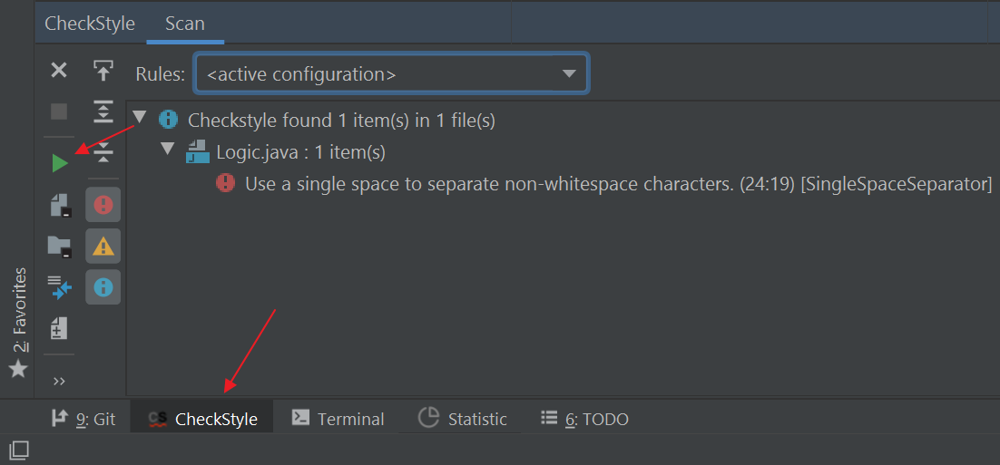

* Table of Contents
{:toc}

--------------------------------------------------------------------------------------------------------------------

## Using Checkstyle-IDEA plugin

Given below are the steps to install the Checkstyle-IDEA plugin so that Intellij can alert you about code style problems as you write code.

1. Install the Checkstyle-IDEA plugin by going to `File` \> `Settings` (Windows/Linux), or `IntelliJ IDEA` \> `Preferences…​` (macOS). Select `Plugins`, press `Browse Repository`, and find the plugin. Restart the IDE to complete the installation.

1. Click `File` \> `Settings…​` \> `Other Settings` \> `Checkstyle`

1. Set `Scan Scope` to `Only Java sources (including tests)`, so that the plugin will run checkstyle for our test source codes as well

1. Ensure that the `Checkstyle version` is set to `8.1`. This is the same version that we are using inside Gradle, so that you won’t get any errors due to version incompatibility. 
   If `Checkstyle version` is not set to `8.1`, set it to version `8.1` and click `Apply` 
   

1.  Click the plus sign under `Configuration File`

1.  Enter an arbitrary description e.g. addressbook

1.  Select `Use a local Checkstyle file`

1.  Use the checkstyle configuration file found at `config/checkstyle/checkstyle.xml`

1.  Click `Next` \> `Finish`

1. Mark `Active` for the newly imported check configuration 
  

1. Click `OK`

1. To verify the plugin is set up correctly, temporirily modify the code to violate a style rule (e.g., add an extra space somewhere) and run the CheckStyle check using the plugin. 
   

#### Troubleshooting

**Problem: When importing `checkstyle.xml`, Checkstyle-IDEA plugin complains that `The Checkstyle rules file could not be parsed. …​ The file has been blacklisted for 60s.`**
* Reason: `checkstyle.xml` is written for a particular version, but the plugin was not configured to the correct version.
* Solution: Ensure that you have selected the correct `Checkstyle
    version` that matches the version in `build.gradle` and have clicked
    `Apply`, as `checkstyle.xml` is written for Gradle’s checkstyle.

**Problem: After setting up `checkstyle.xml`, Checkstyle-IDEA plugin does not seem to highlight the errors / real-time scanning seems broken.**
* Reason: The plugin may not immediately run after setting it up.
* Solution: Restart the IDE.
