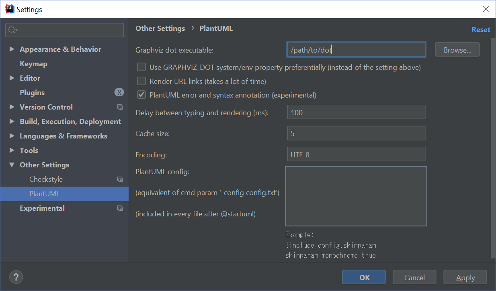
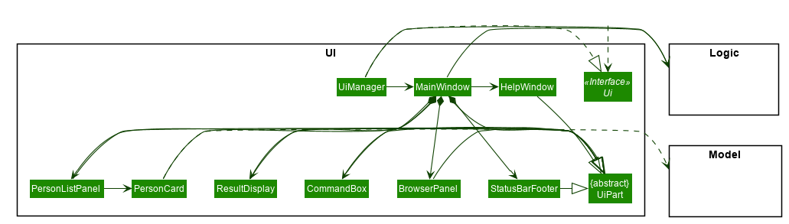
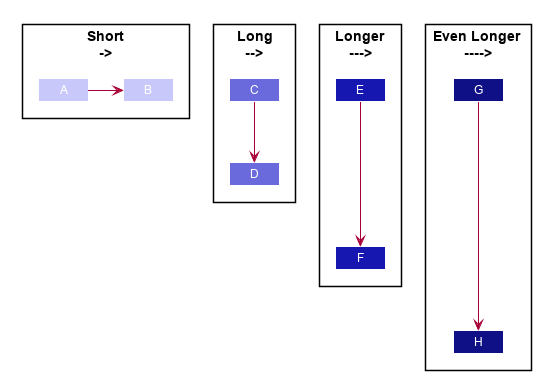
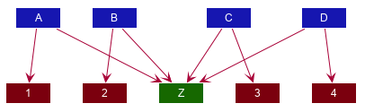
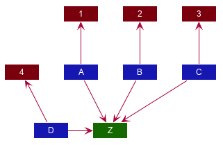
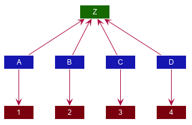
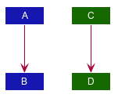
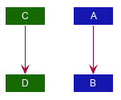
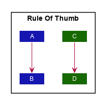

This project uses [PlantUML](http://plantuml.com/) to create UML diagrams. One main advantage of using PlantUML is, as diagrams can be saved in a text format, you can update the diagrams incrementally, as the design evolves over time.

* Table of Contents
{:toc}

------------------------------------------------------------------------------------------------------------------

## Setting up PlantUML

1. **Install Graphviz.** Graphviz is a dependency that PlantUML requires to generate more advanced diagrams. Head over to the [downloads page](https://www.graphviz.org/download/) on the official Graphviz website and follow instructions to install Graphviz.

1. **Install the `PlantUML integration` plugin in IntelliJ IDEA.**

   1. Go to `Settings` \> `Plugins` \> `Marketplace` and install the plugin `PlantUML integration`.

   1. Then go to `Settings` \> `Other Settings` \> `PlantUML` or search for PlantUML. Configure the path to the `dot` executable. This executable can be found in the `/bin` directory where you installed GraphViz.<br>
    

------------------------------------------------------------------------------------------------------------------

## Creating/editing/exporting diagrams

After installing the `PlantUML integration` plugin, simply create or open any `.puml` file to start editing it.


Any changes you make in editor pane on the left will be reflected in the preview pane on the right. However, do take note that these changes *will not* be reflected in your actual documentation until you export the diagram.

The `PlantUML integration` plugin allows you to export individual diagrams to a location of your choosing. Click the `Save Current Diagram Only` button and choose the location to export the image file.

<div markdown="span" class="alert alert-info">:information_source: **Note:** 

You will have to `git add` any new diagrams generated\!
</div>

------------------------------------------------------------------------------------------------------------------

## Tips and tricks

### Maintaining consistency in formatting

It is highly recommended to consistently color your UML diagrams as an visual aid. You can achieve this by creating a dictionary of colors and import it like CSS.

For example, you can create a `Style.puml` with the contents:

**Style.puml.**

```puml
!define LOGIC_COLOR #3333C4
!define LOGIC_COLOR_T1 #7777DB
!define LOGIC_COLOR_T2 #5252CE
!define LOGIC_COLOR_T3 #1616B0
!define LOGIC_COLOR_T4 #101086
```


Then you can use it in another PlantUML file like this:

**UndoSequenceDiagram.puml.**

```puml
!include Style.puml

box Logic LOGIC_COLOR_T2
participant ":LogicManager" as LogicManager LOGIC_COLOR
participant ":AddressBookParser" as AddressBookParser LOGIC_COLOR
participant ":UndoCommand" as UndoCommand LOGIC_COLOR
end box
```

You can fine-tune the formatting of PlantUML diagrams with the `skinparam` command. For example, `skinparam backgroundColor transparent` turns the background of the diagram transparent.

<div markdown="span" class="alert alert-secondary">

:link: **Link**: For a comprehensive list of `skinparam`s head over to the [unofficial PlantUML skinparam documentation](https://plantuml-documentation.readthedocs.io/en/latest/).
</div>


### Repositioning elements

While PlantUML’s automatic layout engine usually produces satisfactory results, at times the result can be less than ideal, especially on larger diagrams. Here is an example where the default layout generated by PlantUML has a lot of overlapping lines that are hard to decipher:



<div markdown="span" class="alert alert-info">

:information_source: **Note:** In most cases, you should consider decomposing the diagram into smaller ones or focusing on a more specific portion of the diagram.

</div>

Here are some techniques you can use to obtain a more palatable diagram.

#### Link lengths

By default, a short link (`->`) points to right and a long link (`-->`) points downwards. you can extend any link to make it longer (`--->`).



#### Link directions

Clever usage of arrow directions will resolve most layout issues. For example, the table below shows how the way in which you specify arrows can results in drastically different layouts for the same diagram.

<table>
<caption>Table: Link directions</caption>
<colgroup>
<col style="width: 40%" />
<col style="width: 60%" />
</colgroup>
<thead>
<tr class="header">
<th>Source</th>
<th>Result</th>
</tr>
</thead>
<tbody>
<tr class="odd">
<td>
<pre>
A --> Z
B --> Z
C --> Z
D --> Z

A --> 1
B --> 2
C --> 3
D --> 4
</pre>
</td>
<td>



</td>
</tr>
<tr class="even">
<td>

<pre>
'default is down
A --> Z
'specify down
B -down-> Z
'shorthand for down
C -d-> Z
'arrow lengths take priority
D -down> Z

A -up-> 1
B -up-> 2
C -up-> 3
D -up-> 4
</pre>

</td>
<td>



</td>
</tr>
<tr class="odd">
<td>

<pre>
A -up-> Z
B -up-> Z
C -up-> Z
D -up-> Z

A --> 1
B --> 2
C --> 3
D --> 4

'Force A B C D
A -right[hidden]- B
B -right[hidden]- C
C -right[hidden]- D
</pre>

</td>
<td>



</td>
</tr>
</tbody>
</table>

**Another technique you can use to influence the layout is to reorder definitions.** The layout engine will attempt to order objects in the order in which they are defined. If there is no formal definition, the objects is taken to be declared upon its first usage.

<table>
<caption>Table: Definition ordering and outcomes</caption>
<colgroup>
<col style="width: 70%" />
<col style="width: 30%" />
</colgroup>
<thead>
<tr class="header">
  <th>Source</th>
  <th>Result</th>
</tr>
</thead>
<tbody>
<tr class="odd">
<td>

<pre>
A --> B
C --> D
</pre>

</td>
<td>



</td>
</tr>
<tr class="even">
<td>

<pre>
'Class C is defined before A
Class C

A --> B
C --> D
</pre>
</td>
<td>



</td>
</tr>
<tr class="odd">
<td>

<pre>
package "Rule Of Thumb";{
    Class C
    A --> B
    C --> D
}
</pre>

</td>
<td>


</td>
</tr>
</tbody>
</table>

<div markdown="span" class="alert alert-primary">:bulb: **Tip:** 
Explicitly define all symbols to avoid any potential layout mishaps.
</div>
