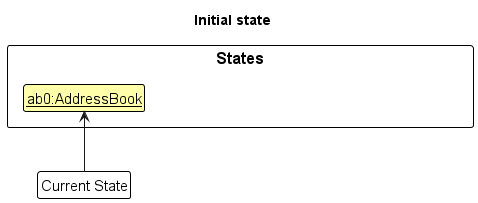
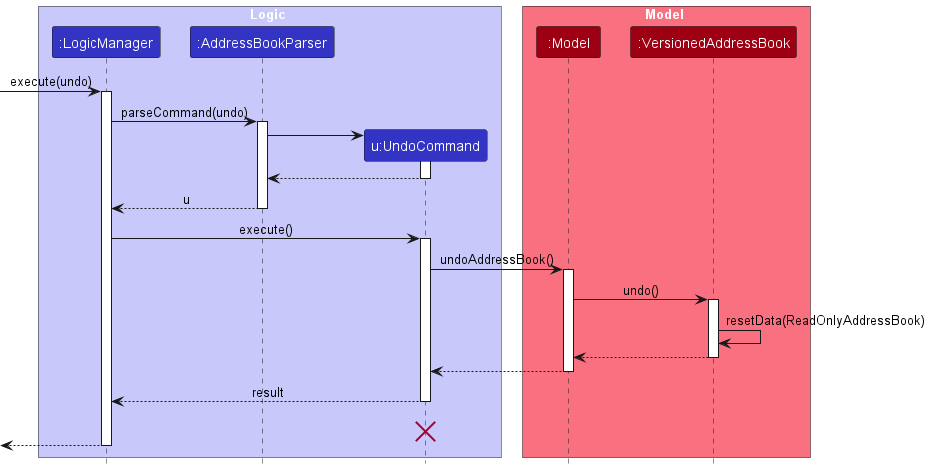

## Overview

AddressBook - Level 3 is a desktop address book application used for
teaching Software Engineering principles. The user interacts with it
using a CLI, and it has a GUI created with JavaFX. It is written in
Java, and has about 10 kLoC.

## Summary of contributions

  - **Major enhancement**: added **the ability to undo/redo previous
    commands**
    
      - What it does: allows the user to undo all previous commands one
        at a time. Preceding undo commands can be reversed by using the
        redo command.
    
      - Justification: This feature improves the product significantly
        because a user can make mistakes in commands and the app should
        provide a convenient way to rectify them.
    
      - Highlights: This enhancement affects existing commands and
        commands to be added in future. It required an in-depth analysis
        of design alternatives. The implementation too was challenging
        as it required changes to existing commands.
    
      - Credits: *{mention here if you reused any code/ideas from
        elsewhere or if a third-party library is heavily used in the
        feature so that a reader can make a more accurate judgement of
        how much effort went into the feature}*

  - **Minor enhancement**: added a history command that allows the user
    to navigate to previous commands using up/down keys.

  - **Code contributed**: \[[Functional code](https://github.com)\]
    \[[Test code](https://github.com)\] *{give links to collated code
    files}*

  - **Other contributions**:
    
      - Project management:
        
          - Managed releases `v1.3` - `v1.5rc` (3 releases) on GitHub
    
      - Enhancements to existing features:
        
          - Updated the GUI color scheme (Pull requests
            [\#33](https://github.com), [\#34](https://github.com))
        
          - Wrote additional tests for existing features to increase
            coverage from 88% to 92% (Pull requests
            [\#36](https://github.com), [\#38](https://github.com))
    
      - Documentation:
        
          - Did cosmetic tweaks to existing contents of the User Guide:
            [\#14](https://github.com)
    
      - Community:
        
          - PRs reviewed (with non-trivial review comments):
            [\#12](https://github.com), [\#32](https://github.com),
            [\#19](https://github.com), [\#42](https://github.com)
        
          - Contributed to forum discussions (examples:
            [1](https://github.com), [2](https://github.com),
            [3](https://github.com), [4](https://github.com))
        
          - Reported bugs and suggestions for other teams in the class
            (examples: [1](https://github.com), [2](https://github.com),
            [3](https://github.com))
        
          - Some parts of the history feature I added was adopted by
            several other class mates ([1](https://github.com),
            [2](https://github.com))
    
      - Tools:
        
          - Integrated a third party library (Natty) to the project
            ([\#42](https://github.com))
        
          - Integrated a new Github plugin (CircleCI) to the team repo

*{you can add/remove categories in the list above}*

# Contributions to the User Guide

|                                                                                                                                  |
| -------------------------------------------------------------------------------------------------------------------------------- |
| *Given below are sections I contributed to the User Guide. They showcase my ability to write documentation targeting end-users.* |

## Deleting a person : `delete`

Deletes the specified person from the address book.  
Format: `delete INDEX`

  - Deletes the person at the specified `INDEX`.

  - The index refers to the index number shown in the displayed person
    list.

  - The index **must be a positive integer** 1, 2, 3, …​

Examples:

  - `list`  
    `delete 2`  
    Deletes the 2nd person in the address book.

  - `find Betsy`  
    `delete 1`  
    Deletes the 1st person in the results of the `find` command.

## Encrypting data files `[coming in v2.0]`

*{explain how the user can enable/disable data encryption}*

# Contributions to the Developer Guide

|                                                                                                                                                                                        |
| -------------------------------------------------------------------------------------------------------------------------------------------------------------------------------------- |
| *Given below are sections I contributed to the Developer Guide. They showcase my ability to write technical documentation and the technical depth of my contributions to the project.* |

## \[Proposed\] Undo/Redo feature

### Proposed Implementation

The undo/redo mechanism is facilitated by `VersionedAddressBook`. It
extends `AddressBook` with an undo/redo history, stored internally as an
`addressBookStateList` and `currentStatePointer`. Additionally, it
implements the following operations:

  - `VersionedAddressBook#commit()` — Saves the current address book
    state in its history.

  - `VersionedAddressBook#undo()` — Restores the previous address book
    state from its history.

  - `VersionedAddressBook#redo()` — Restores a previously undone address
    book state from its history.

These operations are exposed in the `Model` interface as
`Model#commitAddressBook()`, `Model#undoAddressBook()` and
`Model#redoAddressBook()` respectively.

Given below is an example usage scenario and how the undo/redo mechanism
behaves at each step.

Step 1. The user launches the application for the first time. The
`VersionedAddressBook` will be initialized with the initial address book
state, and the `currentStatePointer` pointing to that single address
book state.

Step 2. The user executes `delete 5` command to delete the 5th person in
the address book. The `delete` command calls
`Model#commitAddressBook()`, causing the modified state of the address
book after the `delete 5` command executes to be saved in the
`addressBookStateList`, and the `currentStatePointer` is shifted to the
newly inserted address book state.

Step 3. The user executes `add n/David …​` to add a new person. The
`add` command also calls `Model#commitAddressBook()`, causing another
modified address book state to be saved into the `addressBookStateList`.

If a command fails its execution, it will not call
`Model#commitAddressBook()`, so the address book state will not be saved
into the `addressBookStateList`.

Step 4. The user now decides that adding the person was a mistake, and
decides to undo that action by executing the `undo` command. The `undo`
command will call `Model#undoAddressBook()`, which will shift the
`currentStatePointer` once to the left, pointing it to the previous
address book state, and restores the address book to that state.

If the `currentStatePointer` is at index 0, pointing to the initial
address book state, then there are no previous address book states to
restore. The `undo` command uses `Model#canUndoAddressBook()` to check
if this is the case. If so, it will return an error to the user rather
than attempting to perform the undo.

The following sequence diagram shows how the undo operation works:

The lifeline for `UndoCommand` should end at the destroy marker (X) but
due to a limitation of PlantUML, the lifeline reaches the end of
diagram.

The `redo` command does the opposite — it calls
`Model#redoAddressBook()`, which shifts the `currentStatePointer` once
to the right, pointing to the previously undone state, and restores the
address book to that state.

If the `currentStatePointer` is at index `addressBookStateList.size()
- 1`, pointing to the latest address book state, then there are no
undone address book states to restore. The `redo` command uses
`Model#canRedoAddressBook()` to check if this is the case. If so, it
will return an error to the user rather than attempting to perform the
redo.

Step 5. The user then decides to execute the command `list`. Commands
that do not modify the address book, such as `list`, will usually not
call `Model#commitAddressBook()`, `Model#undoAddressBook()` or
`Model#redoAddressBook()`. Thus, the `addressBookStateList` remains
unchanged.

Step 6. The user executes `clear`, which calls
`Model#commitAddressBook()`. Since the `currentStatePointer` is not
pointing at the end of the `addressBookStateList`, all address book
states after the `currentStatePointer` will be purged. We designed it
this way because it no longer makes sense to redo the `add n/David …​`
command. This is the behavior that most modern desktop applications
follow.

The following activity diagram summarizes what happens when a user
executes a new command:

### Design Considerations

#### Aspect: How undo & redo executes

  - **Alternative 1 (current choice):** Saves the entire address book.
    
      - Pros: Easy to implement.
    
      - Cons: May have performance issues in terms of memory usage.

  - **Alternative 2:** Individual command knows how to undo/redo by
    itself.
    
      - Pros: Will use less memory (e.g. for `delete`, just save the
        person being deleted).
    
      - Cons: We must ensure that the implementation of each individual
        command are correct.

#### Aspect: Data structure to support the undo/redo commands

  - **Alternative 1 (current choice):** Use a list to store the history
    of address book states.
    
      - Pros: Easy for new Computer Science student undergraduates to
        understand, who are likely to be the new incoming developers of
        our project.
    
      - Cons: Logic is duplicated twice. For example, when a new command
        is executed, we must remember to update both `HistoryManager`
        and `VersionedAddressBook`.

  - **Alternative 2:** Use `HistoryManager` for undo/redo
    
      - Pros: We do not need to maintain a separate list, and just reuse
        what is already in the codebase.
    
      - Cons: Requires dealing with commands that have already been
        undone: We must remember to skip these commands. Violates Single
        Responsibility Principle and Separation of Concerns as
        `HistoryManager` now needs to do two different things.

## \[Proposed\] Data Encryption

*{Explain here how the data encryption feature will be implemented}*

# PROJECT: PowerPointLabs

*{Optionally, you may include other projects in your portfolio.}*
