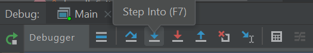

> Indeed, the ratio of time spent reading versus writing is well over 10
> to 1. We are constantly reading old code as part of the effort to
> write new code. …​\[Therefore,\] making it easy to read makes it
> easier to write.
>
> —  Robert C. Martin Clean Code: A Handbook of Agile Software
> Craftsmanship

When trying to understand an unfamiliar code base, one common strategy
used is to trace some representative execution path through the code
base. One easy way to trace an execution path is to use a debugger to
step through the code. In this tutorial, you will be using the IntelliJ
IDEA’s debugger to trace the execution path of a specific user command.

Before we jump into the code, it is useful to get an idea of the overall
structure and the high-level behavior of the application. This is
provided in the 'Architecture' section of the developer guide. In
particular, the architecture diagram (reproduced below), tells us that
the App consists of several components.


It also has a sequence diagram (reproduced below) that tells us how a
command propagates through the App.


Note how the diagram shows only how the execution flows *between* the
main components. That is, it does not show details of the execution path
*inside* each component. By hiding those details, the diagram succeeds
in informing the reader about the overall execution path of a command
without overwhelming the reader with too much details. In this tutorial,
you aim to find those omitted details so that you get a more in-depth
understanding of the code base.

Before we proceed, ensure that you have done the following:

1.  Read the *Architecture* section of the DG

2.  Set up the project in Intellij IDEA

3.  Learn basic debugging features of Intellij IDEA

## Setting a break point

As you know, the first step of debugging is to put in a breakpoint where
you want the debugger to pause the execution. For example, if you are
trying to understand how the App starts up, you would put a breakpoint
in the first statement of the `main` method. In our case, we would want
to begin the tracing at the very point where the App start processing
user input i.e., somewhere in the UI component, and then trace through
how the execution proceeds through the UI component. However, the
execution path through a GUI is often somewhat obscure due to various
*event-driven mechanisms* used by GUI frameworks, which happens to be
the case here too. Therefore, let us put the breakpoint where the UI
transfers control to the Logic component. According to the sequence
diagram, the UI component yields control to the Logic component through
a method named `execute`. Searching through the code base for
`execute()` yields a promising candidate in
`seedu.address.ui.CommandBox.CommandExecutor`.


A quick look at the class confirms that this is indeed close to what
we’re looking for. However, it is just an `Interface`. Let’s delve
further and find the implementation of the interface by using the `Find
Usages` feature in IntelliJ IDEA.


Bingo\! `MainWindow#executeCommand()` seems to be exactly what we’re
looking for\!

Now let’s set the breakpoint. First, double-click the item to reach the
corresponding code. Once there, click on the left gutter to set a
breakpoint, as shown below.


## Tracing the execution path

Recall from the User Guide that the `edit` command has the format: `edit
INDEX [n/NAME] [p/PHONE] [e/EMAIL]
[a/ADDRESS] [t/TAG]…​` For this tutorial we will be issuing the command
`edit 1 n/Alice Yeoh`.

<div markdown="span" class="alert alert-primary">:bulb: <b>Tip: </b>
Over the course of the debugging session, you will encounter every major
component in the application. Try to jot down what happens inside the
component and where the execution transfers to another component.
</div>

1.  To start the debugging session, simply `Run` \> `Debug Main`

2.  Enter `edit 1 n/Alice Yeoh` into the command box and press `Enter`.

3.  The Debugger tool window should show up and look something like
    this:

    

4.  Use the `Show execution point` feature to jump to the line of code
    that we stopped at:

    

5.  `CommandResult commandResult = logic.execute(commandText);` is the
    line that you end up at.

6.  We are interested in the `logic.execute(commandText)` portion of
    that line so let’s `Step in` into that method call:

    

7.  We end up in `LogicManager#execute()`. Let’s take a look at the body
    of the method and annotate what we can deduce.

    **LogicManager\#execute().**

    ``` java
    @Override
    public CommandResult execute(String commandText) throws CommandException, ParseException {
         //Logging, safe to ignore
         logger.info("----------------[USER COMMAND][" + commandText + "]");

         CommandResult commandResult;
         //Parse user input from String to a Command
         Command command = addressBookParser.parseCommand(commandText);
         //Executes the Command and stores the result
         commandResult = command.execute(model);

         try {
             //We can deduce that the previous line of code modifies model in some way
             // since it's being stored here.
             storage.saveAddressBook(model.getAddressBook());
         } catch (IOException ioe) {
             throw new CommandException(FILE_OPS_ERROR_MESSAGE + ioe, ioe);
         }

         return commandResult;
     }
    ```

8.  `LogicManager#execute()` appears to delegate most of the heavy
    lifting to other components. Let’s take a closer look at each one.

9.  `Step over` the logging code since it is of no interest to us now.
    

10. `Step into` the line where user input in parsed from a String to a
    Command.

    **AddressBookParser\#parseCommand().**

    ``` java
    public Command parseCommand(String userInput) throws ParseException {
        ...
        final String commandWord = matcher.group("commandWord");
        final String arguments = matcher.group("arguments");
        ...
    ```

11. `Step over` until you reach the `switch` statement. The `Variables`
    window now shows the value of both `commandWord` and `arguments` :

    

12. We see that the value of `commandWord` is now `edit` but `arguments`
    is still not processed in any meaningful way.

13. Stepping into the `switch`, we obviously stop at

    **AddressBookParser\#parseCommand().**

    ``` java
    ...
    case EditCommand.COMMAND_WORD:
        return new EditCommandParser().parse(arguments);
    ...
    ```

14. Let’s see what `EditCommandParser#parse()` does by stepping into it.

15. Stepping through the method shows that it calls
    `ArgumentTokenizer#tokenize()` and `ParserUtil#parseIndex()` to
    obtain the arguments and index required.

<div markdown="span" class="alert alert-primary">:bulb: <b>Tip: </b>
Sometimes you might end up stepping into functions that are not of
interest. Simply `step out` of them\!
</div>

16. The rest of the method seems to exhaustively check for the existence
    of each possible parameter of the `edit` command and store any
    possible changes in an `EditPersonDescriptor`. Recall that we can
    verify the contents of `editPersonDesciptor` through the `Variable`
    tool window.

    

17. Let’s continue stepping through until we return to
    `LogicManager#execute()`.

    The sequence diagram below shows the details of the execution path
    through the Logic component. Does the execution path you traced in
    the code so far matches with the diagram?

    

18. Now let’s see what happens when we call `command#execute()`\!

    **EditCommand\#execute().**

    ``` java
    @Override
    public CommandResult execute(Model model) throws CommandException {
        ...
        Person personToEdit = lastShownList.get(index.getZeroBased());
        Person editedPerson = createEditedPerson(personToEdit, editPersonDescriptor);
        if (!personToEdit.isSamePerson(editedPerson) && model.hasPerson(editedPerson)) {
            throw new CommandException(MESSAGE_DUPLICATE_PERSON);
        }
        model.setPerson(personToEdit, editedPerson);
        model.updateFilteredPersonList(PREDICATE_SHOW_ALL_PERSONS);
        return new CommandResult(String.format(MESSAGE_EDIT_PERSON_SUCCESS, editedPerson));
    }
    ```

19. As suspected, `command#execute()` does indeed make changes to
    `model`.

20. We can a closer look at how storage works by repeatedly stepping
    into the code until we arrive at
    `JsonAddressBook#saveAddressBook()`.

21. Again, it appears that the heavy lifting is delegated. Let’s take a
    look at `JsonSerializableAddressBook`'s constructor.

    **JsonSerializableAddressBook\#JsonSerializableAddressBook().**

    ``` java
    /**
     * Converts a given {@code ReadOnlyAddressBook} into this class for Jackson use.
     *
     * @param source future changes to this will not affect the created
     * {@code JsonSerializableAddressBook}.
     */
    public JsonSerializableAddressBook(ReadOnlyAddressBook source) {
        persons.addAll(
            source.getPersonList()
                  .stream()
                  .map(JsonAdaptedPerson::new)
                  .collect(Collectors.toList()));
    }
    ```

22. It appears that a `JsonAdaptedPerson` is created for each `Person`
    and then added to the `JsonSerializableAddressBook`.

23. We can continue to step through until we return to
    `MainWindow#executeCommand()`.

24. Stepping into
    `resultDisplay.setFeedbackToUser(commandResult.getFeedbackToUser());`,
    we end up in:

    **ResultDisplay\#setFeedbackToUser().**

    ``` java
    public void setFeedbackToUser(String feedbackToUser) {
        requireNonNull(feedbackToUser);
        resultDisplay.setText(feedbackToUser);
    }
    ```

25. Finally, we step through until we reach the end of
    `MainWindow#executeCommand()`.

## Conclusion

In this tutorial, we traced a valid edit command from raw user input to
the result being displayed to the user. From this tutorial, you learned
more about the inner workings of AddressBook and how the various
components mesh together to form one cohesive product.

Here are some quick questions you can try to answer based on your
execution path tracing. In some cases, you can do further tracing for
the given commands to find exactly what happens.

1.  In this tutorial, we traced the "happy path" (i.e., no errors). What
    do you think will happen if we traced the following commands
    instead? What exceptions do you think will be thrown(if any), where
    will the exceptions be thrown and where will they be handled?

    1.  `redit 1 n/Alice Yu`

    2.  `edit 0 n/Alice Yu`

    3.  `edit 1 n/Alex Yeoh`

    4.  `edit 1`

    5.  `edit 1 n/アリス ユー`

    6.  `edit 1 t/one t/two t/three t/one`

2.  What components will you have to modify to perform the following
    enhancements to the application?

    1.  Make command words case-insensitive

    2.  Allow `delete` to remove more than one index at a time

    3.  Save the address book in the CSV format instead

    4.  Add a new command

    5.  Add a new field to `Person`

    6.  Add a new entity to the address book
